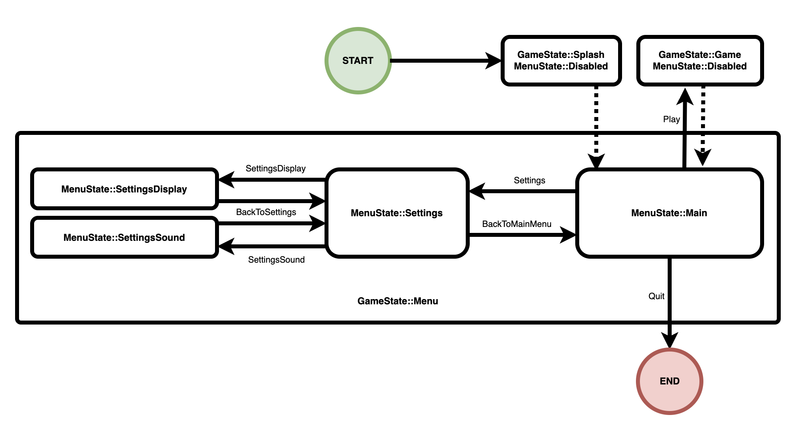

# daily-bevy

Learn [Bevy](https://bevyengine.org/) by exploring a small example (almost) every day.

[Bevy](https://github.com/bevyengine/bevy/) is a free, open-source, cross-platform (Windows, macOS, Linux, Web, iOS, Android) game engine written in [Rust](https://www.rust-lang.org/).

This README shows the seventeenth entry in this series. All other entries can be found at [daily-bevy/branches](https://github.com/awwsmm/daily-bevy/branches).

## Game Menu, Part 3

Today is the seventeenth day of Daily Bevy.

This kata uses [Bevy `v0.12.1`](https://github.com/bevyengine/bevy/tree/v0.12.1).

### Today's Kata

Today, we will be continuing the very long [`game_menu` example](https://github.com/bevyengine/bevy/blob/release-0.12.1/examples/games/game_menu.rs) from the Bevy repo.

Here you can find [Part 1](https://github.com/awwsmm/daily-bevy/tree/games/game_menu) and [Part 2](https://github.com/awwsmm/daily-bevy/tree/games/game_menu_2) of this now three-part kata.

#### The Code

The `main.rs` and `Cargo.toml` for this example are the same as in the two previous parts.

`main.rs` is identical to the example `main.rs` from the Bevy repo.

#### Discussion

Yesterday, we made it partway through dissecting the `menu` `mod`ule. We now understand

- the `button_system` system, which handles changing the color of buttons based on mouse interactions, and 
- the `setting_button`, which handles applying and removing the `SelectedOption` marker `Component`, setting the `DisplayQuality` and `Volume` `Resource`s, and resetting the color of deselected buttons to "normal"

But we've got six more systems in `menu` to understand, so let's get started.

---

The `menu_setup` system is very simple

```rust
fn menu_setup(mut menu_state: ResMut<NextState<MenuState>>) {
    menu_state.set(MenuState::Main);
}
```

It is only used in one place, when we enter the `Menu` `GameState`.

```rust
.add_systems(OnEnter(GameState::Menu), menu_setup)
```

Referring to the diagram from yesterday...



...we can see that whenever we enter the `GameState::Menu`, we are also entering the `MenuState::Main`. This system makes sure that the `MenuState` moves from `Disabled` to `Main` whenever we move from `GameState::Splash` or `GameState::Game` into `GameState::Menu`.

---

The next system, `main_menu_setup`, creates the `Main` settings menu UI. This system is quite a bit longer, clocking in at 130 lines. Let's take it step by step.

First, we define the styling for the buttons

```rust
// Common style for all buttons on the screen
let button_style = Style {
    width: Val::Px(250.0),
    height: Val::Px(65.0),
    margin: UiRect::all(Val::Px(20.0)),
    justify_content: JustifyContent::Center,
    align_items: AlignItems::Center,
    ..default()
};
let button_icon_style = Style {
    width: Val::Px(30.0),
    // This takes the icons out of the flexbox flow, to be positioned exactly
    position_type: PositionType::Absolute,
    // The icon will be close to the left border of the button
    left: Val::Px(10.0),
    ..default()
};
let button_text_style = TextStyle {
    font_size: 40.0,
    color: TEXT_COLOR,
    ..default()
};
```

`Style` is a "UI container node" `Component`, which uses "either [Flexbox](https://developer.mozilla.org/en-US/docs/Web/CSS/CSS_Flexible_Box_Layout/Basic_Concepts_of_Flexbox) or [CSS Grid](https://developer.mozilla.org/en-US/docs/Web/CSS/CSS_Grid_Layout/Basic_Concepts_of_Grid_Layout) Layout". By default, it uses Flexbox.

The `Style` `struct` definition and its documentation comments are just shy of 400 lines of code, so I won't reproduce it all here, but the [tl;dr](https://en.wikipedia.org/wiki/TL;DR) is that `Style` provides lots of [CSS](https://en.wikipedia.org/wiki/CSS) styling, like the dimensions, positions, and vertical and horizontal alignment of the node, as well as margin, padding, border, and more.

In the above example, we define a button as a 250px x 65px rectangle with a 20px margin, and contents which are `Center`ed vertically and horizontally within the node. The `icon` will (presumably) be a child of the button node, 30px wide and positioned 10px to the right of the `left` edge of the button.

Finally, `TextStyle` provides text-specific styling: font face, size, and color are controlled by this `struct`. Note that `Style` is a `Component`, but `TextStyle` isn't.

---

The rest of this system is just one long `commands.spawn(...)` statement.

It starts with the root `NodeBundle`

```rust
commands
    .spawn((
        NodeBundle {
            style: Style {
                width: Val::Percent(100.0),
                height: Val::Percent(100.0),
                align_items: AlignItems::Center,
                justify_content: JustifyContent::Center,
                ..default()
            },
            ..default()
        },
        OnMainMenuScreen,
    ))
    .with_children(|parent| {
        // -- snip --
    });
```

This seems to be a common pattern in UI layouts: the root node is a `NodeBundle` with 100% width and height, and most of the time, child nodes are centered vertically and horizontally by default.

> Note that `align_items` and `justify_content` are _roughly_ equivalent to "vertical" and "horizontal" alignment, but not quite. Here is [an MDN sandbox which gives a visual explanation of `align-items`](https://developer.mozilla.org/en-US/docs/Web/CSS/align-items), and [here is another for `justify-content`](https://developer.mozilla.org/en-US/docs/Web/CSS/justify-content). 

This outermost note is also tagged `OnMainMenuScreen`. So when we `despawn_screen::<OnMainMenuScreen>` (which calls `despawn_recursive`), this will despawn all UI components created by this system.

---

The root `NodeBundle` has a single child node, which is another `NodeBundle`

```rust
commands
    .spawn((
        NodeBundle { /* -- snip -- */ },
        OnMainMenuScreen,
    ))
    .with_children(|parent| {
        parent
            .spawn(NodeBundle {
                style: Style {
                    flex_direction: FlexDirection::Column,
                    align_items: AlignItems::Center,
                    ..default()
                },
                background_color: Color::CRIMSON.into(),
                ..default()
            })
            .with_children(|parent| {
                // -- snip -- [four children are spawned here]
            });
    });
```

This one has a `background_color` (self-explanatory), a `Center` "vertical" alignment (see note about `align-items`, above), and it also defines a `FlexDirection`.

`FlexDirection` is roughly equivalent to the direction in which the nodes are added (left-to-right or right-to-left in a row, or top-to-bottom or bottom-to-top in a column). Again, there is [an MDN sandbox](https://developer.mozilla.org/en-US/docs/Web/CSS/flex-direction) which gives a good visual explanation of the concept.

If you run the example, you see that the menu buttons in the main menu are aligned in a column, with `New Game` on top, `Settings` in the middle, and `Quit` at the bottom.

---

Finally, we are at a node which has more than one child. This one has four

- the menu title "Bevy Game Menu UI"
- the `New Game` button
- the `Settings` button, and
- the `Quit` button

The first child is the simplest

```rust
// Display the game name
parent.spawn(
    TextBundle::from_section(
        "Bevy Game Menu UI",
        TextStyle {
            font_size: 80.0,
            color: TEXT_COLOR,
            ..default()
        },
    )
        .with_style(Style {
            margin: UiRect::all(Val::Px(50.0)),
            ..default()
        }),
);
```

It is a `TextBundle` with some text styling and a `margin`.

The three buttons all follow a similar pattern

```rust
parent
    .spawn((
        ButtonBundle { // <- ButtonBundle
            style: button_style.clone(),
            background_color: NORMAL_BUTTON.into(),
            ..default()
        },
        MenuButtonAction::Play, // <- marker Component
    ))
    .with_children(|parent| { // <- `ButtonBundle` has two children
        let icon = asset_server.load("textures/Game Icons/right.png");

        // child 1: ImageBundle
        parent.spawn(ImageBundle {
            style: button_icon_style.clone(), // <- icon styling
            image: UiImage::new(icon),        // <- icon
            ..default()
        });

        // child 2: TextBundle
        parent.spawn(TextBundle::from_section(
            "New Game",                      // <- text
            button_text_style.clone(),       // <- text styling
        ));
    });
```

Each button is a `ButtonBundle` with two children: an `ImageBundle` containing the `icon` and a `TextBundle` containing the button text. Remember `button_style`, `button_icon_style`, and `button_text_style` are all defined above, so the positioning and styling of all of these elements has already been taken care of.

The `Settings` button...

- uses the `MenuButtonAction::Settings` marker `Component`, instead of `MenuButtonAction::Play`
- uses the `wrench.png` `icon` instead of `right.png`
- contains the text `"Settings"`, rather than `"New Game"`

...but uses otherwise identical code to the snippet above.

Similarly, the `Quit` button...

- uses the `MenuButtonAction::Quit` marker `Component`
- uses the `exitRight.png` `icon`, and
- contains the text `"Quit"`

...but is otherwise identical to the above two buttons, aside from the fact that it does not `.clone()` the `_style`s.

If I were rewriting this example, I would extract this logic into a method, so the differences (or lack thereof) between these three cases would be easier to spot. (See: [Don't Repeat Yourself](https://en.wikipedia.org/wiki/Don%27t_repeat_yourself).)

But that's it! That's the entire `main_menu_setup` system. It wasn't so bad after all. What's next?

---

`settings_menu_setup`, the next system in the `menu` `mod`ule, uses the same building blocks as `main_menu_setup`, but in a slightly different arrangement.

Again, we define some styles

```rust
let button_style = Style {
    width: Val::Px(200.0),
    height: Val::Px(65.0),
    margin: UiRect::all(Val::Px(20.0)),
    justify_content: JustifyContent::Center,
    align_items: AlignItems::Center,
    ..default()
};

let button_text_style = TextStyle {
    font_size: 40.0,
    color: TEXT_COLOR,
    ..default()
};
```

Everything here is familiar to us.

And again, we have a 100% width, 100% height outer node, vertically and horizontally centered, with a marker `Component` and a single child node

```rust
commands
    .spawn((
        NodeBundle {
            style: Style {
                width: Val::Percent(100.0),
                height: Val::Percent(100.0),
                align_items: AlignItems::Center,
                justify_content: JustifyContent::Center,
                ..default()
            },
            ..default()
        },
        OnSettingsMenuScreen,
    ))
    .with_children(|parent| {
        parent
            .spawn(NodeBundle {
                style: Style {
                    flex_direction: FlexDirection::Column,
                    align_items: AlignItems::Center,
                    ..default()
                },
                background_color: Color::CRIMSON.into(),
                ..default()
            })
            .with_children(|parent| {
                for (action, text) in [
                    // -- snip --
            });
    });
```

The `settings_menu` improves on the `main_menu` by eliminating some code duplication, spawning its child nodes / buttons in a loop

```rust
for (action, text) in [
    (MenuButtonAction::SettingsDisplay, "Display"),
    (MenuButtonAction::SettingsSound, "Sound"),
    (MenuButtonAction::BackToMainMenu, "Back"),
] {
    parent
        .spawn((
            ButtonBundle {
                style: button_style.clone(),
                background_color: NORMAL_BUTTON.into(),
                ..default()
            },
            action,
        ))
        .with_children(|parent| {
            parent.spawn(TextBundle::from_section(
                text,
                button_text_style.clone(),
            ));
        });
}
```

Other than the fact that there is no `icon` here, this button-spawning code is more or less identical to the code in the `main_menu`.

There is a huge opportunity here to greatly simplify this example and make it more accessible (and less daunting) to those new to Bevy.

We've got two more menus to construct, though -- the `display_settings_menu` and the `sound_settings_menu` -- and these each follow a different pattern than the `main_menu` and the `settings_menu`. Again, though, they use the same general building blocks we've seen so far.

---

The `display_settings_menu_setup` starts with more style definitions...

```rust
let button_style = Style {
    width: Val::Px(200.0),
    height: Val::Px(65.0),
    margin: UiRect::all(Val::Px(20.0)),
    justify_content: JustifyContent::Center,
    align_items: AlignItems::Center,
    ..default()
};
let button_text_style = TextStyle {
    font_size: 40.0,
    color: TEXT_COLOR,
    ..default()
};
```

...and the now familiar "100% width, 100% height outer node, vertically and horizontally centered, with a marker `Component` and a single child node" pattern

```rust
commands
    .spawn((
        NodeBundle {
            style: Style {
                width: Val::Percent(100.0),
                height: Val::Percent(100.0),
                align_items: AlignItems::Center,
                justify_content: JustifyContent::Center,
                ..default()
            },
            ..default()
        },
        OnDisplaySettingsMenuScreen,
    ))
    .with_children(|parent| {
        parent
            .spawn(NodeBundle {
                style: Style {
                    flex_direction: FlexDirection::Column,
                    align_items: AlignItems::Center,
                    ..default()
                },
                background_color: Color::CRIMSON.into(),
                ..default()
            })
            .with_children(|parent| {
                // -- snip -- [two children spawned here]
            });
    });
```

The inner container node of the `display_settings_menu` has two children:

1. the "top row" of the menu, which contains the text "Display Quality", and the `Low`, `Medium`, and `High` buttons
2. the "bottom row" of the menu, which contains the `Back` button

The top row uses the `Row` `FlexDirection` (the default) to lay out its children left-to-right

```rust
// Create a new `NodeBundle`, this time not setting its `flex_direction`. It will
// use the default value, `FlexDirection::Row`, from left to right.
parent
    .spawn(NodeBundle {
        style: Style {
            align_items: AlignItems::Center,
            ..default()
        },
        background_color: Color::CRIMSON.into(),
        ..default()
    })
```

...other than that, we've seen all of this before.

This "top row" node has four children. The first, the "Display Quality" text, is spawned on its own

```rust
// Display a label for the current setting
parent.spawn(TextBundle::from_section(
    "Display Quality",
    button_text_style.clone(),
));
```

Nice and simple.

The next three children are spawned in a loop

```rust
// Display a button for each possible value
for quality_setting in [
    DisplayQuality::Low,
    DisplayQuality::Medium,
    DisplayQuality::High,
] {
    let mut entity = parent.spawn((
        ButtonBundle {
            style: Style {
                width: Val::Px(150.0),
                height: Val::Px(65.0),
                ..button_style.clone()
            },
            background_color: NORMAL_BUTTON.into(),
            ..default()
        },
        quality_setting,
    ));
    entity.with_children(|parent| {
        parent.spawn(TextBundle::from_section(
            format!("{quality_setting:?}"),
            button_text_style.clone(),
        ));
    });
    if *display_quality == quality_setting {
        entity.insert(SelectedOption);
    }
}
```

Here, we follow a slightly different pattern from what we've seen before -- we `spawn` a child, but then save a reference to that child in an `entity` binding.

We need to do this because we need to add the `SelectedOption` component to the selected `DisplayQuality` so that it can be appropriately styled.

The only other thing to call out here is that we're using the `Debug` `impl`ementation of `DisplayQuality` to label the buttons, with `format!("{quality_setting:?}")`. Although this is unlikely to change, the fact that the `Debug` `fmt` method displays `Enum::Foo` as `"Foo"` is really an implementation detail, and should probably be replaced with hard-coded strings.

Finally, the bottom row of the `display_settings` menu has only one button, and a simple implementation

```rust
// Display the back button to return to the settings screen
parent
    .spawn((
        ButtonBundle {
            style: button_style,
            background_color: NORMAL_BUTTON.into(),
            ..default()
        },
        MenuButtonAction::BackToSettings,
    ))
    .with_children(|parent| {
        parent.spawn(TextBundle::from_section("Back", button_text_style));
    });
```

This is quickly becoming old hat for us.

---

The final menu to look at is the `sound_settings_menu`. As usual, it starts with some styles and the 100%/100% container with a single child node

```rust
fn sound_settings_menu_setup(mut commands: Commands, volume: Res<Volume>) {
    let button_style = Style {
        width: Val::Px(200.0),
        height: Val::Px(65.0),
        margin: UiRect::all(Val::Px(20.0)),
        justify_content: JustifyContent::Center,
        align_items: AlignItems::Center,
        ..default()
    };
    let button_text_style = TextStyle {
        font_size: 40.0,
        color: TEXT_COLOR,
        ..default()
    };

    commands
        .spawn((
            NodeBundle {
                style: Style {
                    width: Val::Percent(100.0),
                    height: Val::Percent(100.0),
                    align_items: AlignItems::Center,
                    justify_content: JustifyContent::Center,
                    ..default()
                },
                ..default()
            },
            OnSoundSettingsMenuScreen,
        ))
        .with_children(|parent| {
            parent
                .spawn(NodeBundle {
                    style: Style {
                        flex_direction: FlexDirection::Column,
                        align_items: AlignItems::Center,
                        ..default()
                    },
                    background_color: Color::CRIMSON.into(),
                    ..default()
                })
                .with_children(|parent| {
                    // -- snip -- [two children spawned here]
                });
        });
}
```

This pattern is repeated in every menu we've seen in this example. Similar to the `display_settings_menu`, the inner node again spawns two children, in a "top row" / "bottom row" layout.

Again, the top row contains a text label, followed by a bunch of buttons `spawn`ed in a loop

```rust
parent.spawn(TextBundle::from_section(
    "Volume",
    button_text_style.clone(),
));

for volume_setting in [0, 1, 2, 3, 4, 5, 6, 7, 8, 9] {
    let mut entity = parent.spawn((
        ButtonBundle {
            style: Style {
                width: Val::Px(30.0),
                height: Val::Px(65.0),
                ..button_style.clone()
            },
            background_color: NORMAL_BUTTON.into(),
            ..default()
        },
        Volume(volume_setting),
    ));
    if *volume == Volume(volume_setting) {
        entity.insert(SelectedOption);
    }
}
```

And again, the bottom row contains a `Back` button and nothing else

```rust
parent
    .spawn((
        ButtonBundle {
            style: button_style,
            background_color: NORMAL_BUTTON.into(),
            ..default()
        },
        MenuButtonAction::BackToSettings,
    ))
    .with_children(|parent| {
        parent.spawn(TextBundle::from_section("Back", button_text_style));
    });
```

---

Finally, we have arrived at the final system of the `menu` `mod`ule: `menu_action`.

```rust
fn menu_action(
    interaction_query: Query<
        (&Interaction, &MenuButtonAction),
        (Changed<Interaction>, With<Button>),
    >,
    mut app_exit_events: EventWriter<AppExit>,
    mut menu_state: ResMut<NextState<MenuState>>,
    mut game_state: ResMut<NextState<GameState>>,
) {
    for (interaction, menu_button_action) in &interaction_query {
        if *interaction == Interaction::Pressed {
            match menu_button_action {
                MenuButtonAction::Quit => app_exit_events.send(AppExit),
                MenuButtonAction::Play => {
                    game_state.set(GameState::Game);
                    menu_state.set(MenuState::Disabled);
                }
                MenuButtonAction::Settings => menu_state.set(MenuState::Settings),
                MenuButtonAction::SettingsDisplay => {
                    menu_state.set(MenuState::SettingsDisplay);
                }
                MenuButtonAction::SettingsSound => {
                    menu_state.set(MenuState::SettingsSound);
                }
                MenuButtonAction::BackToMainMenu => menu_state.set(MenuState::Main),
                MenuButtonAction::BackToSettings => {
                    menu_state.set(MenuState::Settings);
                }
            }
        }
    }
}
```

`menu_action` describes all of the state transitions in the FSM diagram we've seen a few times now


We use an `EventWriter` (we've seen these before) to exit the app when `Quit` is pressed, but otherwise, we just perform the various `MenuState` and `GameState` transitions required for each button press.

You can confirm that the diagram above describes the same state transitions encoded in `menu_action`.

---

The very last thing we have to explore in this entire example is the `game` `mod`ule.

The `GamePlugin` has simple `OnEnter` and `OnExit` schedules, and only two systems

```rust
pub struct GamePlugin;

impl Plugin for GamePlugin {
    fn build(&self, app: &mut App) {
        app.add_systems(OnEnter(GameState::Game), game_setup)
            .add_systems(Update, game.run_if(in_state(GameState::Game)))
            .add_systems(OnExit(GameState::Game), despawn_screen::<OnGameScreen>);
    }
}
```

The `game_setup` system runs when we enter the `Game` `GameState`.

As usual, we've got our 100%/100% container node with a single child

```rust
commands
    .spawn((
        NodeBundle {
            style: Style {
                width: Val::Percent(100.0),
                height: Val::Percent(100.0),
                // center children
                align_items: AlignItems::Center,
                justify_content: JustifyContent::Center,
                ..default()
            },
            ..default()
        },
        OnGameScreen,
    ))
    .with_children(|parent| {
        // First create a `NodeBundle` for centering what we want to display
        parent
            .spawn(NodeBundle {
                style: Style {
                    // This will display its children in a column, from top to bottom
                    flex_direction: FlexDirection::Column,
                    // `align_items` will align children on the cross axis. Here the main axis is
                    // vertical (column), so the cross axis is horizontal. This will center the
                    // children
                    align_items: AlignItems::Center,
                    ..default()
                },
                background_color: Color::BLACK.into(),
                ..default()
            })
            .with_children(|parent| {
                // -- snip --
            })
    });
```

The inner node, again, has two children / two rows. The first is just a node with the text `"Will be back to the menu shortly..."`

```rust
parent.spawn(
    TextBundle::from_section(
        "Will be back to the menu shortly...",
        TextStyle {
            font_size: 80.0,
            color: TEXT_COLOR,
            ..default()
        },
    )
        .with_style(Style {
            margin: UiRect::all(Val::Px(50.0)),
            ..default()
        }),
);
```

The second child / second row displays the currently-configured display and volume settings

```rust
parent.spawn(
    TextBundle::from_sections([
        TextSection::new(
            format!("quality: {:?}", *display_quality),
            TextStyle {
                font_size: 60.0,
                color: Color::BLUE,
                ..default()
            },
        ),
        TextSection::new(
            " - ",
            TextStyle {
                font_size: 60.0,
                color: TEXT_COLOR,
                ..default()
            },
        ),
        TextSection::new(
            format!("volume: {:?}", *volume),
            TextStyle {
                font_size: 60.0,
                color: Color::GREEN,
                ..default()
            },
        ),
    ])
        .with_style(Style {
            margin: UiRect::all(Val::Px(50.0)),
            ..default()
        }),
);
```

This is all just `Text`, and we get the values by dereferencing `display_quality` and `volume`, which are `Res` arguments to this system

```rust
fn game_setup(
    mut commands: Commands,
    display_quality: Res<DisplayQuality>,
    volume: Res<Volume>,
) {
    // -- snip --
}
```

Finally, at the end of the `game_setup` system, we create a 5-second timer. This is the "game" -- it just waits five seconds and then returns to the menu

```rust
// Spawn a 5 seconds timer to trigger going back to the menu
commands.insert_resource(GameTimer(Timer::from_seconds(5.0, TimerMode::Once)));
```

This timer works identically to the one we saw on the splash screen two days ago: there is a second system which gets the current time every `Update`, and moves to the `GameState::Menu` when that timer has expired

```rust
fn game(
    time: Res<Time>,
    mut game_state: ResMut<NextState<GameState>>,
    mut timer: ResMut<GameTimer>,
) {
    if timer.tick(time.delta()).finished() {
        game_state.set(GameState::Menu);
    }
}
```

---

...and that's it! I don't know about you, but I'm exhausted. That was a gigantic example, but I feel like I learned a lot about UIs in Bevy and how to create basic ones. I hope you learned something about FSMs -- if you weren't already familiar with them -- and I hope my diagram helped to explain the state transitions in this example.

We're now able to

- create a game menu
- save game state ([`daily-bevy/tree/scene/scene`](https://github.com/awwsmm/daily-bevy/tree/scene/scene))
- compile to WASM ([`daily-bevy/tree/bonus/WASM`](https://github.com/awwsmm/daily-bevy/tree/bonus/WASM))

...what else do we need to make a complete game?

If WASM is the target, maybe we need to learn how to export save games to a file, or save game state in a cookie, or -- much more complex -- authenticate users and persist game state to a server.

How about mobile dev? Maybe we could try that in an upcoming kata: get one of these examples to compile and run on Android or iOS.

There's still lots to explore!

## Learn More

If you found this first kata interesting, head over to [daily-bevy/branches](https://github.com/awwsmm/daily-bevy/branches) to see the rest of them.

If you have questions, comments, or corrections, please head over to [daily-bevy/discussions](https://github.com/awwsmm/daily-bevy/discussions) to join the conversation.

If you like what you've read above, you can [follow me on Bluesky](https://bsky.app/profile/awwsmm.bsky.social) or [Mastodon](https://mas.to/@awwsmm).
