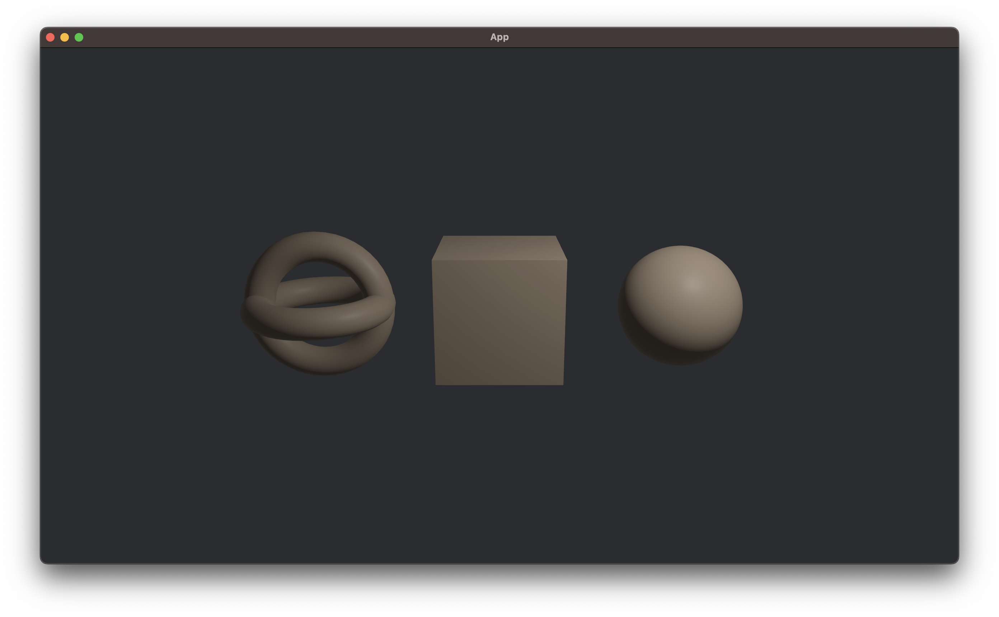
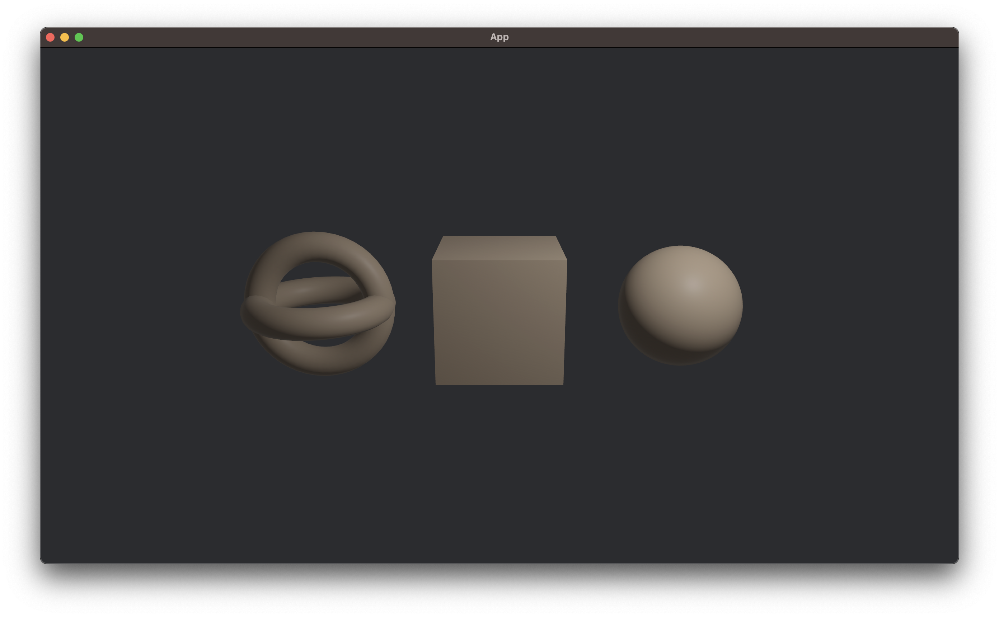
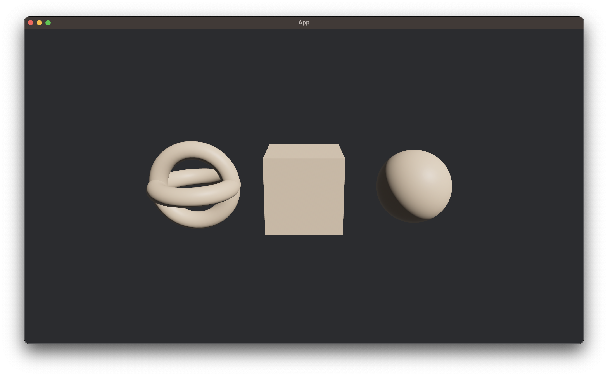

# daily-bevy

Learn [Bevy](https://bevyengine.org/) by exploring a small example (almost) every day.

[Bevy](https://github.com/bevyengine/bevy/) is a free, open-source, cross-platform (Windows, macOS, Linux, Web, iOS, Android) game engine written in [Rust](https://www.rust-lang.org/).

This README shows the eighteenth entry in this series. All other entries can be found at [daily-bevy/branches](https://github.com/awwsmm/daily-bevy/branches).

## v0.13.0

Today is the eighteenth day of Daily Bevy.

[Bevy `v0.13.0` was released today!](https://bevyengine.org/news/bevy-0-13/)

```shell
git diff v0.12.1..v0.13.0 -- examples > examples.diff
```

This diff shows that _162_ files have changed in the `examples/` directory between these two releases. Let's see what's changed in the examples we've covered so far

### [Daily Bevy #1: Hello World](https://github.com/awwsmm/daily-bevy)

```diff
diff --git a/examples/hello_world.rs b/examples/hello_world.rs
index 9b5dc363d..40f55c10c 100644
--- a/examples/hello_world.rs
+++ b/examples/hello_world.rs
@@ -1,3 +1,5 @@
+//! A minimal example that outputs "hello world"
+
 use bevy::prelude::*;
 
 fn main() {
```

Just a new comment here.

### [Daily Bevy #2: File Drag and Drop](https://github.com/awwsmm/daily-bevy/tree/app/drag_and_drop)

No changes.

### [Daily Bevy #3: Keyboard Input](https://github.com/awwsmm/daily-bevy/tree/input/keyboard_input)

```diff
diff --git a/examples/input/keyboard_input.rs b/examples/input/keyboard_input.rs
index 1072e3695..ec9b97973 100644
--- a/examples/input/keyboard_input.rs
+++ b/examples/input/keyboard_input.rs
@@ -10,16 +10,15 @@ fn main() {
 }
 
 /// This system prints 'A' key state
-fn keyboard_input_system(keyboard_input: Res<Input<KeyCode>>) {
-    if keyboard_input.pressed(KeyCode::A) {
+fn keyboard_input_system(keyboard_input: Res<ButtonInput<KeyCode>>) {
+    if keyboard_input.pressed(KeyCode::KeyA) {
         info!("'A' currently pressed");
     }
 
-    if keyboard_input.just_pressed(KeyCode::A) {
+    if keyboard_input.just_pressed(KeyCode::KeyA) {
         info!("'A' just pressed");
     }
-
-    if keyboard_input.just_released(KeyCode::A) {
+    if keyboard_input.just_released(KeyCode::KeyA) {
         info!("'A' just released");
     }
 }
```

This example confused me initially, because I was using Bevy `v0.12.1`, but looking at the examples from `master`. 

Above, you can see that we now use `ButtonInput<KeyCode>` instead of `Input<KeyCode>`, and some keys have been renamed, like `A` to `KeyA`. Other than that, this example is the same as it was before.

### [Daily Bevy #4: Clear Color](https://github.com/awwsmm/daily-bevy/tree/window/clear_color)

```diff
diff --git a/examples/window/clear_color.rs b/examples/window/clear_color.rs
index dc136e3a3..be75c2bf8 100644
--- a/examples/window/clear_color.rs
+++ b/examples/window/clear_color.rs
@@ -17,7 +17,7 @@ fn setup(mut commands: Commands) {
     commands.spawn(Camera2dBundle::default());
 }
 
-fn change_clear_color(input: Res<Input<KeyCode>>, mut clear_color: ResMut<ClearColor>) {
+fn change_clear_color(input: Res<ButtonInput<KeyCode>>, mut clear_color: ResMut<ClearColor>) {
     if input.just_pressed(KeyCode::Space) {
         clear_color.0 = Color::PURPLE;
     }
```

We've got the same `Input` `->` `ButtonInput` change as in the "Keyboard Input" example, but nothing else.

### [Daily Bevy #5-7: Camera2dBundle](https://github.com/awwsmm/daily-bevy/tree/bonus/Camera2dBundle)

This was a `bonus` example, and so doesn't exist in the `examples.diff` file we created above.

So does this example still run with Bevy `v0.13.0`?

```
error: package `bevy v0.13.0` cannot be built because it requires rustc 1.76.0 or newer, while the currently active rustc version is 1.75.0
```

The first thing I need to do is to update to the latest Rust version using `rustup update`

```
$ rustup update
info: syncing channel updates for 'stable-aarch64-apple-darwin'
info: latest update on 2024-02-08, rust version 1.76.0 (07dca489a 2024-02-04)
error: component 'rust-std' for target 'asmjs-unknown-emscripten' is unavailable for download for channel 'stable'
```

This is saying that I have some `target` installed which is not yet supported on Rust `1.76.0`. I don't really need this `target` anymore, so let's uninstall that and try again

```
$ rustup target remove asmjs-unknown-emscripten
info: removing component 'rust-std' for 'asmjs-unknown-emscripten'
```

```
$ rustup update
...
  stable-aarch64-apple-darwin updated - rustc 1.76.0 (07dca489a 2024-02-04) (from rustc 1.75.0 (82e1608df 2023-12-21))
```

Compiling again...

```
error[E0412]: cannot find type `Input` in this scope
  --> src/main.rs:62:25
   |
62 |     keyboard_input: Res<Input<KeyCode>>,
   |                         ^^^^^ not found in this scope
```

```
error[E0433]: failed to resolve: use of undeclared type `TextAlignment`
  --> src/main.rs:21:26
   |
21 |     let text_alignment = TextAlignment::Center;
   |                          ^^^^^^^^^^^^^ use of undeclared type `TextAlignment`
```

We've got the same `Input` `->` `ButtonInput` change, but what's wrong with `TextAlignment`?

Searching `examples.diff` for `TextAlignment` shows that it was also a simple rename, to `JustifyText`

```diff
diff --git a/examples/2d/text2d.rs b/examples/2d/text2d.rs
index 18a959bef..637948871 100644
--- a/examples/2d/text2d.rs
+++ b/examples/2d/text2d.rs
@@ -38,14 +38,14 @@ fn setup(mut commands: Commands, asset_server: Res<AssetServer>) {
         font_size: 60.0,
         color: Color::WHITE,
     };
-    let text_alignment = TextAlignment::Center;
+    let text_justification = JustifyText::Center;
```

All of the `KeyCode`s that we used in this example have been renamed as well

```
error[E0599]: no variant or associated item named `Left` found for enum `bevy::prelude::KeyCode` in the current scope
  --> src/main.rs:65:40
   |
65 |     if keyboard_input.pressed(KeyCode::Left) {
   |                                        ^^^^ variant or associated item not found in `KeyCode`
```

`Up`, `Down`, `Left`, and `Right` are now `ArrowUp`, `ArrowDown`, `ArrowLeft`, and `ArrowRight`.

One last thing is still failing

```
error[E0599]: no method named `with_alignment` found for struct `bevy::prelude::Text` in the current scope
  --> src/main.rs:38:18
   |
37 |               text: Text::from_section("Hello, Bevy!", text_style.clone())
   |  ___________________-
38 | |                 .with_alignment(text_alignment),
   | |                 -^^^^^^^^^^^^^^ method not found in `Text`
   | |_________________|
```

Looks like `with_alignment` no longer works the way it used to, either. Searching `examples.diff` for this method reveals, again, that this is just a simple rename

```diff
diff --git a/examples/2d/text2d.rs b/examples/2d/text2d.rs
index 18a959bef..637948871 100644
--- a/examples/2d/text2d.rs
+++ b/examples/2d/text2d.rs

...

         Text2dBundle {
             text: Text::from_section("translation", text_style.clone())
-                .with_alignment(text_alignment),
+                .with_justify(text_justification),
```

With all of these renames...

- `Input` to `ButtonInput`
- `TextAlignment` to `JustifyText`
- `Up`, `Down`, `Left`, and `Right` to `ArrowUp`, `ArrowDown`, `ArrowLeft`, and `ArrowRight`
- `with_alignment` to `with_justify`

...this `bonus` `example` works just as well on `v0.13.0` as it used to on `v0.12.1`.

Try it for yourself! `main.rs` on this branch contains this example with the necessary renames to get it running on `v0.13.0`.

### [Daily Bevy #8: Text 2D](https://github.com/awwsmm/daily-bevy/tree/2d/text2d)

No changes here other than the renames already discussed above.

### [Daily Bevy #9: 3D Shapes](https://github.com/awwsmm/daily-bevy/tree/3d/3d_shapes)

This is the first example which has a bunch of nontrivial changes. Let's look at them on chunk at a time.

First, we've got a new import: `render::render_asset::RenderAssetUsages`

```diff
diff --git a/examples/3d/3d_shapes.rs b/examples/3d/3d_shapes.rs
index 999d11a74..dc005f48e 100644
--- a/examples/3d/3d_shapes.rs
+++ b/examples/3d/3d_shapes.rs
@@ -5,7 +5,10 @@ use std::f32::consts::PI;
 
 use bevy::{
     prelude::*,
-    render::render_resource::{Extent3d, TextureDimension, TextureFormat},
+    render::{
+        render_asset::RenderAssetUsages,
+        render_resource::{Extent3d, TextureDimension, TextureFormat},
+    },
 };
 
 fn main() {
@@ -20,7 +23,7 @@ fn main() {
 #[derive(Component)]
 struct Shape;
 
```

`X_EXTENT` was decreased, as well. This parameter controls the spacing between the 3D shapes rendered in this example.

```diff
-const X_EXTENT: f32 = 14.5;
+const X_EXTENT: f32 = 12.0;
```

This is probably related to the fact that we now have one fewer shape than we did previously. The Shape API has changed quite a bit.

Below...

- instead of `shape::Cube::default()` and `shape::Box::default()`, we use `Cuboid::default()`
- instead of `shape::Capsule`, `shape::Torus`, and `shape::Cylinder`, we now use `Capsule3d`, `Torus`, and `Cylinder`
- `shape::Icosphere` and `shape::UVSphere` are now created with `.ico()` and `.uv()` methods on `Sphere`
- we no longer need `.into()` in many places

...and more.

These new shapes are [described in the `v0.13.0` release notes](https://bevyengine.org/news/bevy-0-13/#primitive-shapes). These shapes no longer need `.into()` because they now implement [the new `Meshable` trait](https://docs.rs/bevy/0.13.0/bevy/prelude/trait.Meshable.html), and `Mesh` `impl`ements `From` using this trait, for example...

```rust
impl Meshable for Sphere {
    type Output = SphereMeshBuilder;

    fn mesh(&self) -> Self::Output {
        SphereMeshBuilder {
            sphere: *self,
            ..Default::default()
        }
    }
}
```

```rust
impl From<Sphere> for Mesh {
    fn from(sphere: Sphere) -> Self {
        sphere.mesh().build()
    }
}
```

There's one more piece of the puzzle here, though, as we need a change in `Asset`, from

```rust
impl<A: Asset> Assets<A> {
    // -- snip --
    pub fn add(&mut self, asset: A) -> Handle<A> {
        // -- snip --
    }
    // -- snip --    
}
```

to

```rust
impl<A: Asset> Assets<A> {
    // -- snip --
    pub fn add(&mut self, asset: impl Into<A>) -> Handle<A> {
        // -- snip --
    }
    // -- snip --    
}
```

This means we don't need to pass a `Mesh`, but only something which can be turned `Into` a `Mesh`, like `Sphere`.

```diff
 fn setup(
     mut commands: Commands,
@@ -34,13 +37,12 @@ fn setup(
     });
 
     let shapes = [
-        meshes.add(shape::Cube::default().into()),
-        meshes.add(shape::Box::default().into()),
-        meshes.add(shape::Capsule::default().into()),
-        meshes.add(shape::Torus::default().into()),
-        meshes.add(shape::Cylinder::default().into()),
-        meshes.add(shape::Icosphere::default().try_into().unwrap()),
-        meshes.add(shape::UVSphere::default().into()),
+        meshes.add(Cuboid::default()),
+        meshes.add(Capsule3d::default()),
+        meshes.add(Torus::default()),
+        meshes.add(Cylinder::default()),
+        meshes.add(Sphere::default().mesh().ico(5).unwrap()),
+        meshes.add(Sphere::default().mesh().uv(32, 18)),
     ];
 
     let num_shapes = shapes.len();
@@ -64,9 +66,9 @@ fn setup(
```

The next change in this example is in the construction of a `PointLight`: `intensity` has changed from `9000.0` to `10_000_000.`. Why would the intensity need to increase by over three orders of magnitude?

```diff
     commands.spawn(PointLightBundle {
         point_light: PointLight {
-            intensity: 9000.0,
-            range: 100.,
             shadows_enabled: true,
+            intensity: 10_000_000.,
+            range: 100.0,
             ..default()
         },
         transform: Transform::from_xyz(8.0, 16.0, 8.0),
@@ -75,8 +77,8 @@ fn setup(
```

This is probably due to the [change in camera exposure in `v0.13.0`](https://bevyengine.org/news/bevy-0-13/#camera-exposure) meant to align Bevy closer to [Blender](https://www.blender.org/) defaults

> "You may notice that point lights now require significantly higher intensity values (in lumens). This (sometimes) million-lumen values might feel exorbitant. Just reassure yourself that (1) it actually requires a lot of light to meaningfully register in an overcast outdoor environment and (2) Blender exports lights on these scales (and we are calibrated to be as close as possible to them)."

Next, we've got the same `shape` / `Mesh` changes we saw above, plus a `Color` which apparently no longer needs an `.into()` to be added to list of `materials`

```diff
     // ground plane
     commands.spawn(PbrBundle {
-        mesh: meshes.add(shape::Plane::from_size(50.0).into()),
-        material: materials.add(Color::SILVER.into()),
+        mesh: meshes.add(Plane3d::default().mesh().size(50.0, 50.0)),
+        material: materials.add(Color::SILVER),
         ..default()
     });
```

...this second change is thanks to this `From<Color>` implementation for `StandardMaterial`

```rust
impl From<Color> for StandardMaterial {
    fn from(color: Color) -> Self {
        StandardMaterial {
            base_color: color,
            alpha_mode: if color.a() < 1.0 {
                AlphaMode::Blend
            } else {
                AlphaMode::Opaque
            },
            ..Default::default()
        }
    }
}
```

...and the change to `Asset`, described above, which lets us pass an `Into<StandardMaterial>` instead of requiring a `StandardMaterial` directly.

Finally, one more small change, `new_fill` has a new argument, so we have to provide a new parameter here

```diff
@@ -117,5 +119,6 @@ fn uv_debug_texture() -> Image {
         TextureDimension::D2,
         &texture_data,
         TextureFormat::Rgba8UnormSrgb,
+        RenderAssetUsages::RENDER_WORLD,
     )
 }
```

This `RenderAssetUsages` argument saves on RAM usage

```rust
bitflags::bitflags! {
    /// Defines where the asset will be used.
    ///
    /// If an asset is set to the `RENDER_WORLD` but not the `MAIN_WORLD`, the asset will be
    /// unloaded from the asset server once it's been extracted and prepared in the render world.
    ///
    /// Unloading the asset saves on memory, as for most cases it is no longer necessary to keep
    /// it in RAM once it's been uploaded to the GPU's VRAM. However, this means you can no longer
    /// access the asset from the CPU (via the `Assets<T>` resource) once unloaded (without re-loading it).
    ///
    /// If you never need access to the asset from the CPU past the first frame it's loaded on,
    /// or only need very infrequent access, then set this to `RENDER_WORLD`. Otherwise, set this to
    /// `RENDER_WORLD | MAIN_WORLD`.
    ///
    /// If you have an asset that doesn't actually need to end up in the render world, like an Image
    /// that will be decoded into another Image asset, use `MAIN_WORLD` only.
    #[repr(transparent)]
    #[derive(Serialize, TypePath, Deserialize, Hash, Clone, Copy, PartialEq, Eq, Debug)]
    pub struct RenderAssetUsages: u8 {
        const MAIN_WORLD = 1 << 0;
        const RENDER_WORLD = 1 << 1;
    }
}
```

### [Daily Bevy #10: Button](https://github.com/awwsmm/daily-bevy/tree/ui/button)

The only change to this example was a removal of the `clippy::type_complexity` annotation

```diff
diff --git a/examples/ui/button.rs b/examples/ui/button.rs
index 5e3706857..27ab4a19a 100644
--- a/examples/ui/button.rs
+++ b/examples/ui/button.rs
@@ -1,10 +1,6 @@
 //! This example illustrates how to create a button that changes color and text based on its
 //! interaction state.
 
-// This lint usually gives bad advice in the context of Bevy -- hiding complex queries behind
-// type aliases tends to obfuscate code while offering no improvement in code cleanliness.
-#![allow(clippy::type_complexity)]
-
 use bevy::{prelude::*, winit::WinitSettings};
 
 fn main() {
```

But as I noted in the [discussion on this Daily Bevy](https://github.com/awwsmm/daily-bevy/tree/ui/button?tab=readme-ov-file#discussion), this `allow` is necessary, or `clippy` complains about types in this example. So how is it that we can now remove it without issues?

Well, `#![allow(clippy::type_complexity)]` existed in tons of places throughout Bevy, and so [is now just `allow`ed generally](https://github.com/bevyengine/bevy/pull/10011). This change removes nearly a hundred individual `allow`s and replaces them with a single `Cargo.toml` setting.

### [Daily Bevy #11: WASM](https://github.com/awwsmm/daily-bevy/tree/bonus/WASM)

This is another `bonus` kata.

This example uses the same code as the Button example, and so doesn't need any code changes; it runs exactly the same with `v0.13.0` as it did with `v0.12.1`.

One thing I will note here is that in this example, I said "you can simply open the `example.html` file in a browser." This is not entirely true. Some browsers (Chrome, for example) will complain about ["cross-origin resource sharing"](https://developer.mozilla.org/en-US/docs/Web/HTTP/CORS), and so you do need to [set up a web server to serve the example to a browser](https://github.com/bevyengine/bevy/tree/abb8c353f49a6fe9e039e82adbe1040488ad910a/examples#build--run-2). The easiest way to do this is to run

```shell
cargo install basic-http-server
```

...to install a Cargo-managed HTTP server, and start the server with

```shell
basic-http-server .
```

This should give output like

```
[INFO ] basic-http-server 0.8.1
[INFO ] addr: http://127.0.0.1:4000
[INFO ] root dir: .
[INFO ] extensions: false
```

_Then_, you can open the example by navigating to `http://127.0.0.1:4000/example.html` in a browser.

Note that [RustRover](https://www.jetbrains.com/rust/), the IDE I recommend for Rust development, has a built-in HTTP server, which means you don't need to `cargo install basic-http-server` when using RustRover.

### [Daily Bevy #12: Asset Loading](https://github.com/awwsmm/daily-bevy/tree/asset/asset_loading)

The only thing that has changed in this example is that we swapped a `PointLightBundle` for a `DirectionalLightBundle`

```diff
diff --git a/examples/asset/asset_loading.rs b/examples/asset/asset_loading.rs
index 6a931dc62..24b912597 100644
--- a/examples/asset/asset_loading.rs
+++ b/examples/asset/asset_loading.rs
@@ -79,8 +79,8 @@ fn setup(
         ..default()
     });
     // light
-    commands.spawn(PointLightBundle {
-        transform: Transform::from_xyz(4.0, 5.0, 4.0),
+    commands.spawn(DirectionalLightBundle {
+        transform: Transform::from_xyz(4.0, 5.0, 4.0).looking_at(Vec3::ZERO, Vec3::Y),
         ..default()
     });
     // camera
```

In other examples -- but not all of them -- this change has been made. `PointLightBundle` still exists in `v0.13.0`. So why the change?

Here's what this example looked like in `v0.12.1`



Here's `v0.13.0` with this `DirectionalLightBundle` reverted to a `PointLightBundle`



Maybe a bit brighter, with noticeably lighter shadows on the `torus_handle` and the `sphere`. But here's `v0.13.0` with the new `DirectionalLightBundle`



Note that this was not a single change; many commits exist between `v0.12.1` and `v0.13.0`, and so it's possible that some group of changes was made that made sense in aggregate, and then some other group of changes was made, but the net effect of those changes has resulted in a less-than-desirable outcome.

In this case, I think the new `DirectionalLightBundle` looks very washed out, and I think this should be reverted to the original `PointLightBundle`.

### [Daily Bevy #13: Scene](https://github.com/awwsmm/daily-bevy/tree/scene/scene)

Here, we just alter a single `reflect` annotation (and a comment)

```diff
diff --git a/examples/scene/scene.rs b/examples/scene/scene.rs
index 7120fd419..ef2aef66d 100644
--- a/examples/scene/scene.rs
+++ b/examples/scene/scene.rs
@@ -34,7 +34,7 @@ struct ComponentA {
 // trait comes into play. `FromWorld` gives you access to your App's current ECS `Resources`
 // when you construct your component.
 #[derive(Component, Reflect)]
-#[reflect(Component)]
+#[reflect(Component, FromWorld)]
 struct ComponentB {
     pub value: String,
     #[reflect(skip_serializing)]
@@ -118,7 +118,8 @@ fn save_scene_system(world: &mut World) {
     scene_world.spawn(ComponentA { x: 3.0, y: 4.0 });
     scene_world.insert_resource(ResourceA { score: 1 });
 
-    // With our sample world ready to go, we can now create our scene:
+    // With our sample world ready to go, we can now create our scene using DynamicScene or DynamicSceneBuilder.
+    // For simplicity, we will create our scene using DynamicScene:
     let scene = DynamicScene::from_world(&scene_world);
 
     // Scenes can be serialized like this:
```

...do we need this? What happens if we remove `FromWorld`?

Nothing, it seems. I think this change is unnecessary, the output of this example with or without this `FromWorld` is identical.

### [Daily Bevy #14: Reflection](https://github.com/awwsmm/daily-bevy/tree/reflection/reflection)

Here, we just make a `pub struct` private

```diff
diff --git a/examples/reflection/reflection.rs b/examples/reflection/reflection.rs
index 8f874633f..6033b4139 100644
--- a/examples/reflection/reflection.rs
+++ b/examples/reflection/reflection.rs
@@ -49,7 +49,7 @@ pub struct Bar {
 }
 
 #[derive(Default)]
-pub struct NonReflectedValue {
+struct NonReflectedValue {
     _a: usize,
 }
```

...so no significant changes.

### [Daily Bevy #15-17: Game Menu](https://github.com/awwsmm/daily-bevy/tree/games/game_menu)

Finally, we get to the most recent kata.

There have been no changes whatsoever to this example between `v0.12.1` and `v0.13.0`.

---

So in summary

- a lot of things got renamed, but renames are really easy to fix
- the [new primitive shapes](https://bevyengine.org/news/bevy-0-13/#primitive-shapes) resulted in lots of changes to the [3D Shapes example](https://github.com/awwsmm/daily-bevy/tree/3d/3d_shapes)
- the [recalibrated light sources](https://bevyengine.org/news/bevy-0-13/#camera-exposure) required changing the intensity or brightness in any example using light sources, though it looks like this was done by find-and-replace in some places and this has resulted in overexposed examples, like [Asset Loading](https://github.com/awwsmm/daily-bevy/tree/asset/asset_loading)
- `Asset`'s `add()` method taking an `asset: impl Into<A>` instead of an `asset: A` has made `add()` more flexible and less cumbersome for users
- ditto for the new `Meshable` trait
- `#![allow(clippy::type_complexity)]` is now Bevy-idiomatic, encoded in the `Cargo.toml` for the entire workspace

---

Phew! Bevy `v0.13.0` brings in a huge number of changes, and we're only gotten through about a dozen of the `examples` in the repo so far. Even so, these required a fair number of changes to stay functional with the new version of Bevy.

As the team at Bevy release a new version roughly every 3 months, we should be through most of the `examples` by the time the next version is available. I don't want to think how many updates we'll need to make then! But that's a problem for future me.

## Learn More

If you found this first kata interesting, head over to [daily-bevy/branches](https://github.com/awwsmm/daily-bevy/branches) to see the rest of them.

If you have questions, comments, or corrections, please head over to [daily-bevy/discussions](https://github.com/awwsmm/daily-bevy/discussions) to join the conversation.

If you like what you've read above, you can [follow me on Bluesky](https://bsky.app/profile/awwsmm.bsky.social) or [Mastodon](https://mas.to/@awwsmm).
